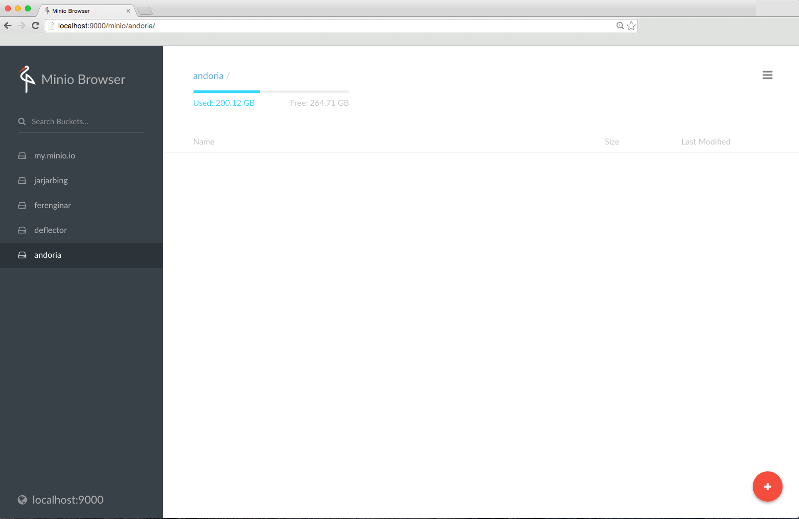

# Minio Quickstart Guide
Minio is an object storage server released under Apache License v2.0. It is compatible with Amazon S3 cloud storage service. It is best suited for storing unstructured data such as photos, videos, log files, backups and container / VM images. Size of an object can range from a few KBs to a maximum of 5TB.

##  1. Download
Minio server is light enough to be bundled with the application stack, similar to NodeJS, Redis and MySQL.

| Platform| Architecture | URL|
| ----------| -------- | ------|
|GNU/Linux|64-bit Intel|https://dl.minio.io/server/minio/release/linux-amd64/minio|
||32-bit Intel|https://dl.minio.io/server/minio/release/linux-386/minio|
||32-bit ARM|https://dl.minio.io/server/minio/release/linux-arm/minio|
|Apple OS X|64-bit Intel|https://dl.minio.io/server/minio/release/darwin-amd64/minio|
|Microsoft Windows|64-bit|https://dl.minio.io/server/minio/release/windows-amd64/minio.exe|
||32-bit|https://dl.minio.io/server/minio/release/windows-386/minio.exe|
|FreeBSD|64-bit|https://dl.minio.io/server/minio/release/freebsd-amd64/minio|


### Install from Source 

Source installation is only intended for developers and advanced users. If you do not have a working Golang environment, please follow [How to install Golang](/docs/how-to-install-golang).

```sh
$ go get -d github.com/minio/minio
$ cd $GOPATH/src/github.com/minio/minio
$ make
```
 ## 2.  Run Minio Server
 
 `` 1. GNU/Linux``
 ```sh
 $ chmod +x minio
$ ./minio --help
$ ./minio server ~/Photos

AccessKey: WLGDGYAQYIGI833EV05A  SecretKey: BYvgJM101sHngl2uzjXS/OBF/aMxAN06JrJ3qJlF Region: us-east-1

Minio Object Storage:
     http://127.0.0.1:9000
     http://10.0.0.3:9000

Minio Browser:
     http://127.0.0.1:9000
     http://10.0.0.3:9000

To configure Minio Client:
    $ wget https://dl.minio.io/client/mc/release/linux-amd64/mc
    $ chmod 755 mc
    $ ./mc config host add myminio http://localhost:9000 WLGDGYAQYIGI833EV05A BYvgJM101sHngl2uzjXS/OBF/aMxAN06JrJ3qJlF
 ```
 ``2. OS X``
 ```sh
 $ chmod 755 minio
$ ./minio --help
$ ./minio server ~/Photos

AccessKey: WLGDGYAQYIGI833EV05A  SecretKey: BYvgJM101sHngl2uzjXS/OBF/aMxAN06JrJ3qJlF Region: us-east-1

Minio Object Storage:
     http://127.0.0.1:9000
     http://10.0.0.3:9000

Minio Browser:
     http://127.0.0.1:9000
     http://10.0.0.3:9000

To configure Minio Client:
    $ wget https://dl.minio.io/client/mc/release/darwin-amd64/mc
    $ chmod 755 mc
    $ ./mc config host add myminio http://localhost:9000 WLGDGYAQYIGI833EV05A BYvgJM101sHngl2uzjXS/OBF/aMxAN06JrJ3qJlF
 ```
``3.Microsoft Windows``
```sh
C:\Users\Username\Downloads> minio.exe --help
C:\Users\Username\Downloads> minio.exe server D:\Photos

AccessKey: WLGDGYAQYIGI833EV05A SecretKey: BYvgJM101sHngl2uzjXS/OBF/aMxAN06JrJ3qJlF Region: us-east-1

Minio Object Storage: 
     http://127.0.0.1:9000 
     http://10.0.0.3:9000

Minio Browser: 
     http://127.0.0.1:9000 
     http://10.0.0.3:9000

To configure Minio Client: 
    Download "mc" from https://dl.minio.io/client/mc/release/windows-amd64/mc 
    > mc.exe config host add myminio http://localhost:9000 WLGDGYAQYIGI833EV05A BYvgJM101sHngl2uzjXS/OBF/aMxAN06JrJ3qJlF
```
``4. Docker Container``
```sh
$ docker pull minio/minio
$ docker run -p 9000:9000 minio/minio
```
## 3. Test Minio Server using Minio Browser
Open a web browser and navigate to http://127.0.0.1:9000 to view your buckets on minio server.



 
## 4. Test Minio Server using `mc`
Install mc  from [here](https://docs.minio.io/docs/minio-client-quick-start-guide).  Use `mc ls` command to list all the buckets on your minio server.
 
```sh
$ mc ls myminio/
[2015-08-05 08:13:22 IST]     0B andoria/
[2015-08-05 06:14:26 IST]     0B deflector/
[2015-08-05 08:13:11 IST]     0B ferenginar/
[2016-03-08 14:56:35 IST]     0B jarjarbing/
[2016-01-20 16:07:41 IST]     0B my.minio.io/
```

For more examples please navigate to [Minio Client Complete Guide](/docs/minio-client-complete-guide).

## 5. Explore Further
- [Minio Erasure Code QuickStart Guide](docs.minio.io/docs/minio-erasure-code-quickstart-guide)
- [Minio Docker Quickstart Guide](docs.minio.io/docs/minio-docker-container)
- [Use `mc` with Minio Server](docs.minio.io/docs/minio-client-quick-start-guide) 
- [Use `aws-cli` with Minio Server](docs.minio.io/docs/how-to-use-aws-cli-with-minio) 
- [Use `s3cmd` with Minio Server](docs.minio.io/docs/s3cmd-with-minio-server) 
- [Use `minio-go` SDK with Minio Server](/docs/golang-client-quickstart-guide) 
 
 
## 6. Contribute to Minio Project
Please follow Minio [Contributor's Guide](./CONTRIBUTING.md)
 
 
