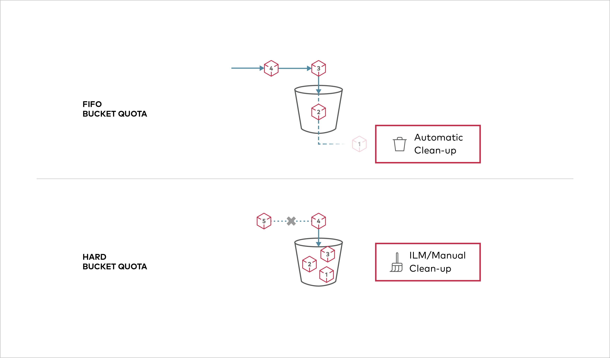

# Bucket Quota Configuration Quickstart Guide [](https://slack.min.io) [](https://hub.docker.com/r/minio/minio/)



Buckets can be configured to have one of two types of quota configuration - FIFO and Hard quota.

- `Hard` quota disallows writes to the bucket after configured quota limit is reached.
- `FIFO` quota automatically deletes oldest content until bucket usage falls within configured limit while permitting writes.

> NOTE: Bucket quotas are not supported under Gateway deployments.

## 1. Prerequisites
- Install MinIO - [MinIO Quickstart Guide](https://docs.min.io/docs/minio-quickstart-guide).
- [Use `mc` with MinIO Server](https://docs.min.io/docs/minio-client-quickstart-guide)

## 2. Set bucket quota configuration

1. Set a hard quota of 1GB for a bucket `mybucket` on MinIO object storage:

```sh
$ mc admin bucket quota myminio/mybucket --hard 1gb
```

2. Set FIFO quota of 5GB for a bucket "mybucket" on MinIO to allow automatic deletion of older content to ensure bucket usage remains within 5GB

```sh
$ mc admin bucket quota myminio/mybucket --fifo 5gb
```

3. Verify the quota configured on `mybucket` on MinIO

```sh
$ mc admin bucket quota myminio/mybucket
```

4. Clear bucket quota configuration for `mybucket` on MinIO

```sh
$ mc admin bucket quota myminio/mybucket --clear
```
