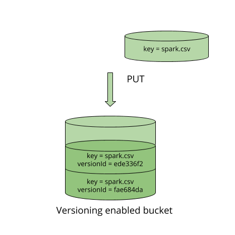
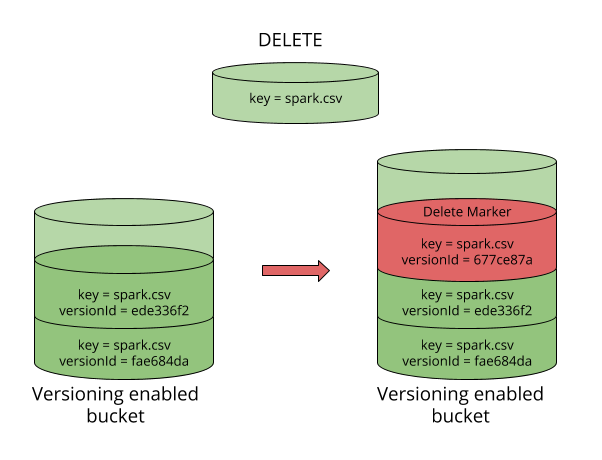
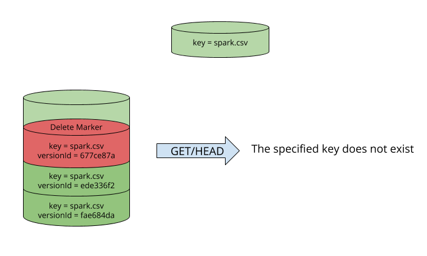
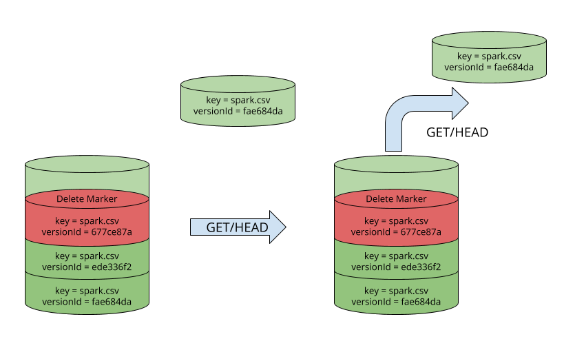
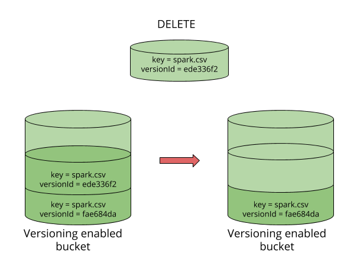

# Bucket Versioning Guide  

MinIO versioning is designed to keep multiple versions of an object in one bucket. For example, you could store `spark.csv` (version `ede336f2`) and `spark.csv` (version `fae684da`) in a single bucket. Versioning protects you from unintended overwrites, deletions, to apply retention policies and archive your objects.

To custom data retention and storage usage, use object versioning with object lifecycle management.  If you have an object expiration lifecycle policy in your non-versioned bucket and you want to maintain the same permanent delete behavior when on versioning-enabled bucket, you must add a noncurrent expiration policy. The noncurrent expiration lifecycle policy will manage the deletes of the noncurrent object versions in the versioning-enabled bucket. (A version-enabled bucket maintains one current and zero or more noncurrent object versions.)

Versioning must be explicitly enabled on a bucket, versioning is not enabled by default. Object locking enabled buckets have versioning enabled automatically. Enabling and suspending versioning is done at the bucket level.

Only MinIO generates version IDs, and they can't be edited. Version IDs are simply of `DCE 1.1 v4 UUID 4` (random data based), UUIDs are 128 bit numbers which are intended to have a high likelihood of uniqueness over space and time and are computationally difficult to guess. They are globally unique identifiers which can be locally generated without contacting a global registration authority. UUIDs are intended as unique identifiers for both mass tagging objects with an extremely short lifetime and to reliably identifying very persistent objects across a network.

When you PUT an object in a versioning-enabled bucket, the noncurrent version is not overwritten. The following figure shows that when a new version of `spark.csv` is PUT into a bucket that already contains an object with the same name, the original object (ID = `ede336f2`) remains in the bucket, MinIO generates a new version (ID = `fae684da`), and adds the newer version to the bucket.

This means accidental overwrites or deletes of objects are protected, allows previous version of on object to be retrieved.

When you DELETE an object, all versions remain in the bucket and MinIO adds a delete marker, as shown below:

Now the delete marker becomes the current version of the object. GET requests by default always retrieve the latest stored version. So performing a simple GET object request when the current version is a delete marker would return `404` `The specified key does not exist` as shown below:

GET requests by specifying a verison ID as shown below, you can retrieve the specific object version `fae684da`.

To permanently delete an object you need to specify the version you want to delete, only the user with appropriate permissions can permanently delete a version.  As shown below DELETE request called with a specific version id permenantly deletes an object from a bucket. Delete marker is not added for DELETE requests with version id.

## Concepts
- All Buckets on MinIO are always in one of the following states: unversioned (the default) and all other existing deployments, versioning-enabled, or versioning-suspended.
- Versioning state applies to all of the objects in the versioning enabled bucket. The first time you enable a bucket for versioning, objects in the bucket are thereafter always versioned and given a unique version ID.
- Existing or newer buckets can be created with versioning enabled and eventually can be suspended as well. Existing versions of objects stay as is and can still be accessed using the version ID.
- All versions, including delete-markers should be deleted before deleting a bucket.
