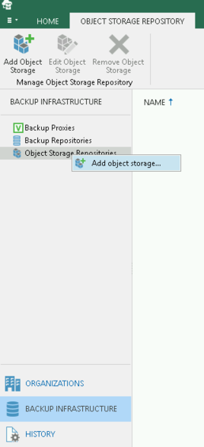
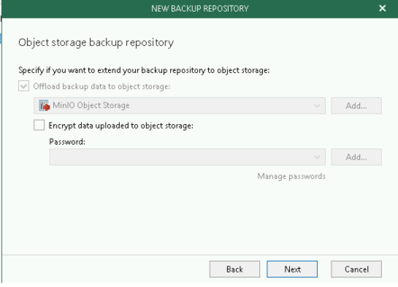

# Using MinIO with Veeam

When using Veeam Backup and Replication, you can use S3 compatible object storage such as MinIO as a capacity tier for backups.  This disaggregates storage for the Veeam infrastructure and allows you to retain control of your data. With the ease of use of setup and administration of MinIO, it allows a Veeam backup admin to easily deploy their own object store for capacity tiering.

__Prerequisites__
- One or both of Veeam Backup and Replication with support for S3 compatible object store (e.g. 9.5.4) and Veeam Backup for Office365 (VBO)
- MinIO object storage set up per https://docs.min.io/docs/minio-quickstart-guide.html
- Veeam requires TLS connections to the object storage.  This can be configured per https://docs.minio.io/docs/how-to-secure-access-to-minio-server-with-tls.html
- The S3 bucket, Access Key and Secret Key have to be created before and outside of Veeam.
- Configure the minio client for the Veeam MinIO endpoint - https://docs.min.io/docs/minio-client-quickstart-guide.html


## Setting up an S3 compatible object store for Veeam Backup and Replication
### Create a bucket for Veeam backups
Create a bucket for Veeam Backup, e.g., `mc mb myminio/veeambackup`

### Add MinIO as an object store for Veeam
Follow the steps from the Veeam documentation for adding MinIO as an object store - https://helpcenter.veeam.com/docs/backup/vsphere/adding_s3c_object_storage.html?ver=100


### Creating the Scale-out Backup Repository

1. Under the Backup Infrastructure view, click on Scale-out Repositories and click the Add Scale-out Repository button on the ribbon.

2. Follow the on screen wizard

3. On the Capacity Tier screen, check the box to Extend scale-out backup repository capacity with object storage checkbox and select the object storage. If you want to be able to test backup data immediately after a job is run, under the object storage selection, check the "Copy" box and uncheck the "Move" box.
 

### Create a backup job
#### Backup Virtual Machines with Veeam Backup and Replication

1. Under Home > Jobs > Backup in Navigation Pane, click on Backup Job button in the ribbon and choose Virtual Machine. Follow the on screen wizard.

2. On the Storage screen, choose the Scale-out Backup Repository that was configured previously.    

4. Continue with the backup job creation.  On the Summary screen, check the Run the Job when I click Finish checkbox and click the Finish button.
The backup job will start immediately.  This will create an Active Full backup of the VMs within the backup job. 

5. Since we selected Copy mode when creating the SOBR, the backup will be copied to the capacity tier as soon as it is created on the performance tier.  
 
#### Backup Office 365 with VBO
1. Create a new bucket for VBO backups
`mc mb myminio/vbo`

2. Under Backup Infrastructure, right click on Object Storage Repositories and choose "Add object storage"



3. Follow through the wizard as above for Veeam Backup and Replication as the steps are the same between both products

4. Under Backup Infrastructure -> Backup Repositories, right click and "Add Backup Repository"

5. Follow the wizard.  Under the "Object Storage Backup Repository" section, choose the MinIO object storage you created above



6. When you create your backup job, choose the backup repository you created above.  


## Test the setup
The next time the backup job runs, you can use the  `mc admin trace myminio` command and verify traffic is flowing to the MinIO nodes. For Veeam Backup and Replication you will need to wait for the backup to complete to the performance tier before it migrates data to the capacity tier (i.e., MinIO).

```
20:09:10.216 [200 OK] s3.GetObject veeam-minio01:9000/vbo/Veeam/Backup365/vbotest/Organizations/6571606ecbc4455dbfe23b83f6f45597/Webs/ca2d0986229b4ec88e3a217ef8f04a1d/Items/efaa67764b304e77badb213d131beab6/f4f0cf600f494c3eb702d8eafe0fabcc.aac07493e6cd4c71845d2495a4e1e19b 139.178.68.158    9.789ms      ↑ 90 B ↓ 8.5 KiB
20:09:10.244 [200 OK] s3.GetObject veeam-minio01:9000/vbo/Veeam/Backup365/vbotest/RepositoryLock/cad99aceb50c49ecb9e07246c3b9fadc_bfd985e5deec4cebaf481847f2c34797 139.178.68.158    16.21ms      ↑ 90 B ↓ 402 B
20:09:10.283 [200 OK] s3.PutObject veeam-minio01:9000/vbo/Veeam/Backup365/vbotest/CommonInfo/WebRestorePoints/18f1aba8f55f4ac6b805c4de653eb781 139.178.68.158    29.787ms     ↑ 1005 B ↓ 296 B
```
